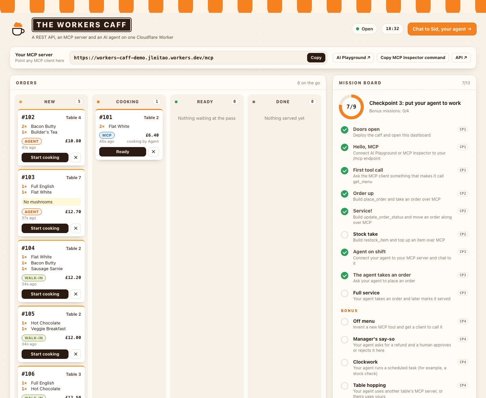
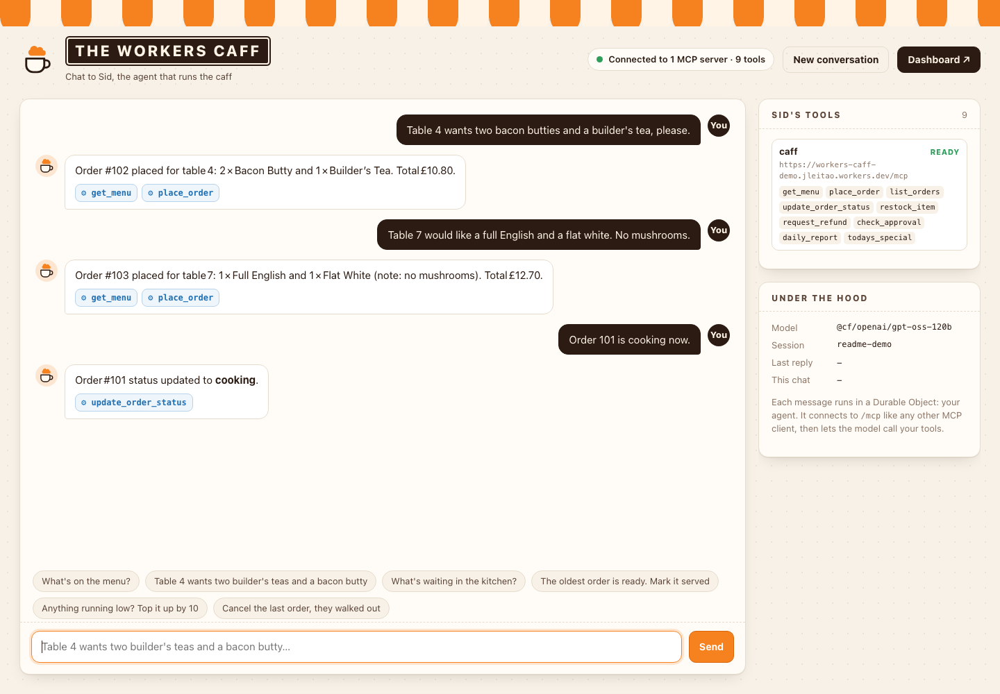

# The Workers Caff

Hackathon starter for **Build with Cloudflare London**, 29 September 2026.

The Workers Caff is a London greasy spoon that runs on a single Cloudflare Worker. It already has a REST API, a live dashboard and a database. This afternoon you give it an MCP server, then hand that server to Sid, the AI agent who manages the place, and watch him take orders on the dashboard.

[](https://deploy.workers.cloudflare.com/?url=https://github.com/GoncaloLeitao/workers-caff-hackathon)



## Pick a path

**The guided path** takes you from "it's deployed" to "an agent runs the caff" in four checkpoints. Each one takes 15 to 30 minutes, and one command skips ahead if you get stuck. Follow [docs/guide.md](docs/guide.md).

**Your own project** can be anything you like on Cloudflare. Use this repo as a base or ignore it. [docs/ideas.md](docs/ideas.md) has ideas and links to get you going.

Either way, staff will come round the tables, and there are prizes for the best builds. The [cheat sheet](CHEATSHEET.md) has every URL and command on it.

## Get the caff running

You need a free Cloudflare account ([sign up here](https://dash.cloudflare.com/sign-up)). To work on your laptop you also need Node.js 22 or later and Git.

### Option A: the Deploy button

1. Click **Deploy to Cloudflare** above and log in to Cloudflare.
2. Connect GitHub or GitLab. Cloudflare copies this repo into your account, then builds and deploys it. The defaults are fine.
3. When it finishes, open your Worker's URL. That's your dashboard.
4. To change the code, clone your new repo, edit, commit and `git push`. Every push to `main` redeploys in about a minute. You can also run `npm install` and `npm run deploy` from your clone.

### Option B: from your laptop

```sh
git clone https://github.com/GoncaloLeitao/workers-caff-hackathon.git
cd workers-caff-hackathon
npm install
npx wrangler login
npm run deploy
```

Wrangler prints your URL, something like `https://workers-caff.<your-subdomain>.workers.dev`. On a brand-new account it asks you to pick a `workers.dev` subdomain first. Any name will do.

`npm run dev` runs the same thing locally at http://localhost:8787. Sid's model runs on Workers AI in your account even in local dev, so you still need to be logged in.

## What's inside

```text
                        one Worker: src/index.ts
  browser      ──▶  /           dashboard            public/index.html
  browser      ──▶  /chat       chat with Sid        public/chat.html
  curl, apps   ──▶  /api/*      REST API             src/caff/api.ts
  MCP clients  ──▶  /mcp        your MCP server      src/mcp.ts     ◀ Checkpoint 2
  the chat UI  ──▶  /agents/*   your agent, Sid      src/agent.ts   ◀ Checkpoint 3
                        │
                        ▼
      CaffStore: a Durable Object with SQLite (menu, orders, stock, missions)
```

Sid is built with the [Agents SDK](https://developers.cloudflare.com/agents/). Every chat session gets its own agent instance, which is a Durable Object, so it remembers the conversation. He reaches your MCP server over its public URL, exactly as AI Playground or Claude would, and thinks with a model on [Workers AI](https://developers.cloudflare.com/workers-ai/).

You only need to edit `src/mcp.ts` and `src/agent.ts`. Everything in `src/caff/` is plumbing: have a read, but you don't have to change it.



## The checkpoints

| | Goal | Where | Stuck? |
|---|---|---|---|
| 1 | Deploy, open the dashboard, connect an MCP client and call `get_menu` | nothing to edit | grab one of the staff |
| 2 | Build four MCP tools: `place_order`, `list_orders`, `update_order_status`, `restock_item` | `src/mcp.ts` | `npm run skip:mcp` |
| 3 | Connect Sid to your MCP server and chat to him at `/chat` | `src/agent.ts` | `npm run skip:agent` |
| 4 | Stretch: approvals, scheduled jobs, memory, table hopping, tools of your own | anywhere | `npm run skip:stretch` |

The mission board on the dashboard ticks itself off as you go, so you (and we) can see how far you've got.

## Commands

| Command | What it does |
|---|---|
| `npm run dev` | Run the caff locally at http://localhost:8787 |
| `npm run deploy` | Deploy to Cloudflare |
| `npm run smoke -- <url>` | Health check for the API and MCP server. Add `--write` to test the write tools and `--agent` to ask Sid a question |
| `npm run check` | Type-check the project |
| `npm run skip:mcp` | Drop in a finished `src/mcp.ts` (Checkpoint 2) |
| `npm run skip:agent` | Drop in a finished `src/agent.ts` (Checkpoint 3) |
| `npm run skip:all` | Both of the above |
| `npm run skip:stretch` | Both, plus the stretch goals |
| `npx wrangler tail` | Stream live logs from your deployed Worker |

The skip commands back your file up to `src/*.ts.bak` first, so you never lose work.

## The model and the free plan

Sid uses `@cf/openai/gpt-oss-120b`, set in `wrangler.jsonc` under `vars.MODEL`. It's quick and dependable at calling tools, and the free plan's 10,000 Neurons a day cover about 80 replies. If you run out, switch to `@cf/zai-org/glm-4.7-flash`: slower, but about a third of the cost. The chat page shows the tokens each reply used.

## Using an AI coding assistant

Go ahead. `AGENTS.md` (plus `CLAUDE.md`, a Cursor rule and Copilot instructions) asks assistants to coach you through the TODOs rather than paste the answers, so you still learn how it works. If you want the finished version, the skip commands are there for that.

## When something goes wrong

- **Deploy to Cloudflare says "Failed to get repository contents".** Try again in a private window, off any company VPN. If it still fails, skip the button: clone the repo and run `npm install`, `npx wrangler login` and `npm run deploy` (see [Get the caff running](#get-the-caff-running)).
- **Sid says he isn't connected.** You haven't finished Checkpoint 3, or you haven't deployed since. See [the guide](docs/guide.md#checkpoint-3-put-sid-to-work).
- **New tools don't show up.** Cloudflare OS checks for new tools every 5 minutes: wait, then start a new chat. In AI Playground, open **Custom MCP → Tools** and select **Refresh**.
- **AI Playground says the demo is limited to 10 messages.** Start a new chat, or use the event's Cloudflare OS at [cfos.cfevents.dev](https://cfos.cfevents.dev) instead (see [the guide](docs/guide.md#3-connect-an-mcp-client)).
- **Error 1042** means the `global_fetch_strictly_public` flag is missing from `wrangler.jsonc`. Sid needs it to call your Worker's public URL.
- **"You've used today's free Workers AI allowance".** Switch model as described above.
- **Anything else:** run `npm run smoke -- <your-url>` and `npx wrangler tail`, then check the [troubleshooting table](docs/guide.md#troubleshooting).

## More

- [docs/guide.md](docs/guide.md): the guided path, step by step
- [docs/ideas.md](docs/ideas.md): stretch challenges and ideas for your own project
- [docs/facilitators.md](docs/facilitators.md): notes for the people running the room
- [CHEATSHEET.md](CHEATSHEET.md): every URL and command on one double-sided sheet ([PDF](docs/cheatsheet.pdf))
